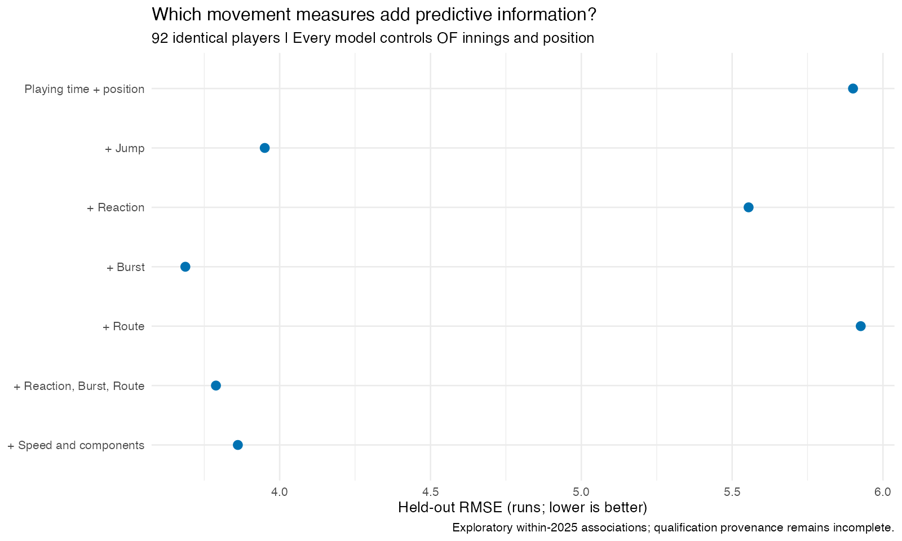

# Arm or Legs? Outfield Defense in MLB

**By Leo Foust**  
**Tools:** R, tidyverse, ggplot2, R Markdown

## Overview

A strong throw from the outfield is easy to notice, but getting to a ball in the gap can save runs too. I wanted to know which part of outfield defense separates players more: their range or their throwing ability.

Using 2025 MLB data, I compared range and arm runs, looked at the differences between LF, CF, and RF, and tested whether speed, Jump, and arm strength helped explain defensive results. I also made leaderboards for season totals and runs per 450 innings, the equivalent of 50 full games in the field.

## Research Questions

1. Does range separate outfielders more than throwing ability does?
2. Does that balance change between left, center, and right field?
3. Does Jump explain range better than sprint speed alone?
4. Does throwing harder lead to better arm results, and is there a point where extra velocity matters more?
5. Do runners attempt to advance less often against stronger arms?

## Main Findings

### Range made the bigger difference between players

Among the same 107 outfielders, range runs had a **standard deviation of 6.15 runs**, compared with **2.18 for arm runs**. Standard deviation measures how spread out the results are, so range accounted for larger differences between players in this sample. That pattern also held after adjusting for playing time.

This does not mean I would always pick the player with better range. A one-run advantage in range offsets a one-run disadvantage in throwing. The overall comparison depends on how much better each player is at both.

### The position question had a less clear answer

Range varied more than arm value in LF, CF, and RF. Center field initially showed a larger balance toward range than right field, but that difference became much smaller when I required at least 450 innings. The uncertainty was too large to establish a firm ranking between positions.

Allowing Jump and arm strength to have different relationships at each position also did not improve the range or arm models' prediction errors. That does **not** establish that position does not matter.

### Jump helped explain range more than speed alone

Adding Jump to the range model lowered prediction error from **5.90 to 3.95 runs**. Adding Sprint Speed lowered it to **5.66 runs**. This suggests that how an outfielder moves to the ball adds information beyond how fast he can run.

Burst stood out among the Jump components, although its small advantage over overall Jump needs more testing.

### Arm strength helped, but did not explain everything

Adding arm strength lowered the arm model's prediction error from **2.15 to 1.91 runs**. A curved relationship improved the score by only another **0.005 runs**, so I did not find evidence for a useful velocity threshold in this model.

Stronger arms also did not meaningfully improve predictions of how often runners attempted to advance. This analysis did not provide strong evidence that arm strength alone explained those decisions.

### The leaderboard changed after adjusting for playing time

**Pete Crow-Armstrong** led the combined season leaderboard with **24.5 runs above average**. **Ceddanne Rafaela** led per 450 innings at **8.20 runs**, just ahead of Crow-Armstrong at **8.13**. The rate leaderboard requires at least 450 outfield innings.

## Data and Methods

### Data preparation

I used **2025 Baseball Savant data** for range runs, arm runs, Sprint Speed, Jump, and Arm Strength, plus **FanGraphs outfield innings**. Range and arm runs are both measured above average, so they can be compared and added on the same scale.

I joined the files by player ID and checked seasons, missing values, and playing time. Players were assigned a main position if at least 60% of their outfield innings came there; the rest were grouped as multi-position.

The samples included **107 players** for the range-versus-arm comparison, **92** for the movement models, and **118** for the throwing models. These differ because not every player had every measurement. Competing models within each question used the same players.

### Models and prediction error

I used **multiple linear regression** to examine how several measurements together related to defensive runs. The range baseline included innings and position; the arm baseline included advancement opportunities and position. I then added speed, Jump, or arm strength to see whether predictions improved.

For runner attempts, I used a **quasibinomial model**, which compares attempts with non-attempts while accounting for the number of opportunities behind each player's rate.

I tested predictions with **leave-one-player-out cross-validation**: leave one player out, fit the model on everyone else, predict the player left out, and repeat.

The main score was **RMSE (root mean squared error)**. It squares the prediction errors, averages them, and takes the square root. Lower is better, and larger misses count more heavily. For the range and arm models, the score is measured in runs. These are predictions for held-out players within 2025, not forecasts for future seasons.

### Checking the results

I checked different playing-time requirements, position cutoffs, and the effect of removing individual players. I also used **bootstrap sampling**, repeatedly resampling players to estimate uncertainty. The position comparison used rates per 450 innings and wider uncertainty intervals to account for comparing three pairs of positions.

## Takeaways and Limitations

My main takeaway is that range was the bigger source of differences in defensive runs in this sample, and Jump helped explain those results better than speed alone. Throwing still mattered, and evaluating an individual player means looking at both parts of his defense.

This covers one season and selected players with available data. It shows relationships, not cause and effect. The position comparisons use each player's full outfield season, rather than separate run values for innings at each position. Arm strength is also an input to the arm-value framework, so those measures are not fully independent.

A season check caught a problem with the original arm-strength file. I replaced it with verified 2025 data and reran the affected analyses. [Data sources and correction details](docs/provenance_audit.md).

## Code and Leaderboards

- [R scripts](R/)
- [Season leaderboard](reports/combined_runs_leaderboard.md)
- [Leaderboard per 450 innings](reports/runs_per_450_leaderboard.md)

*Source data remain subject to their providers' terms.*
