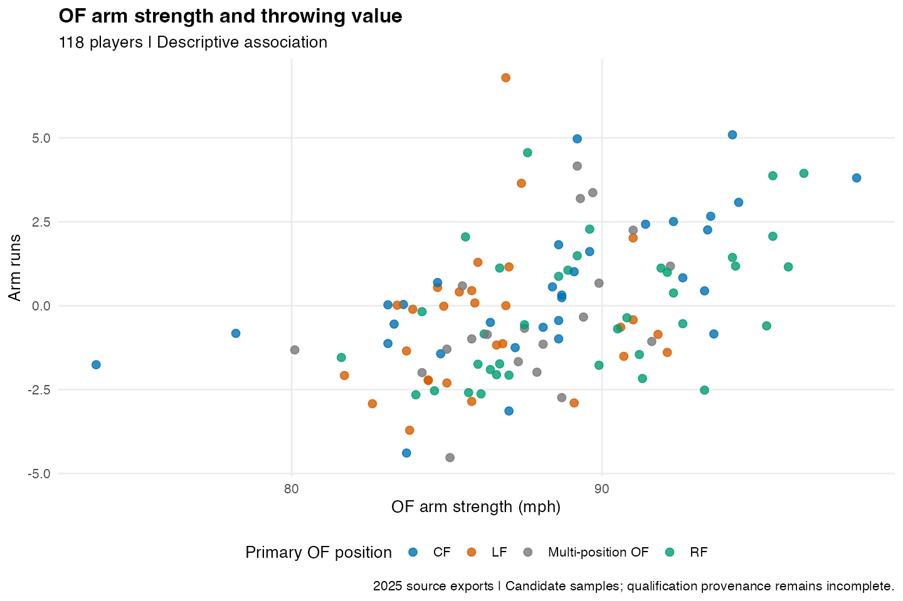
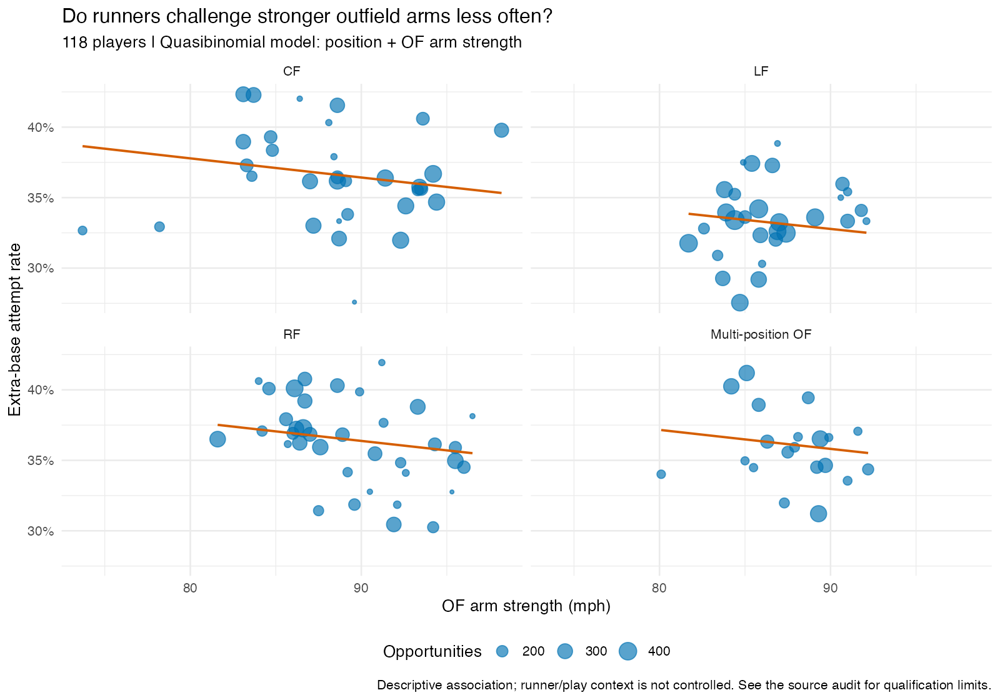
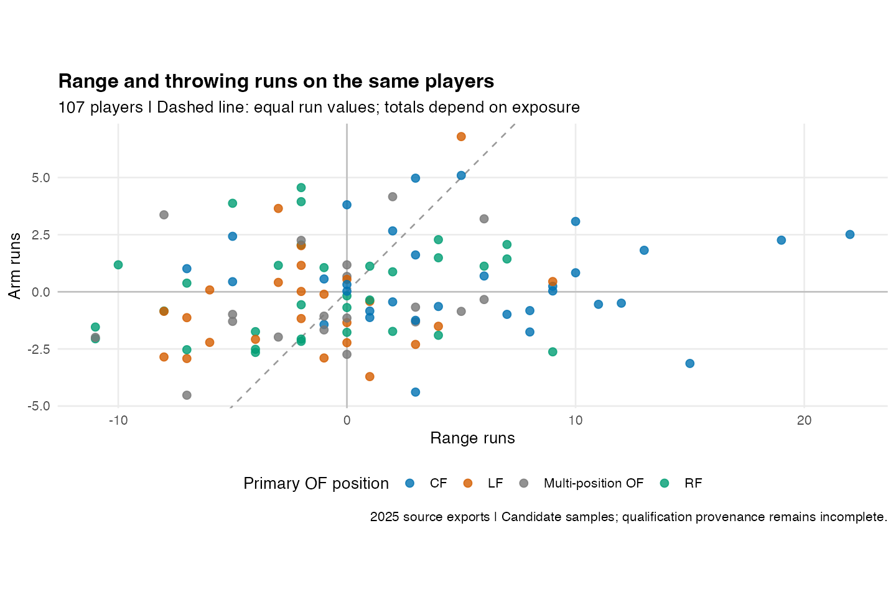
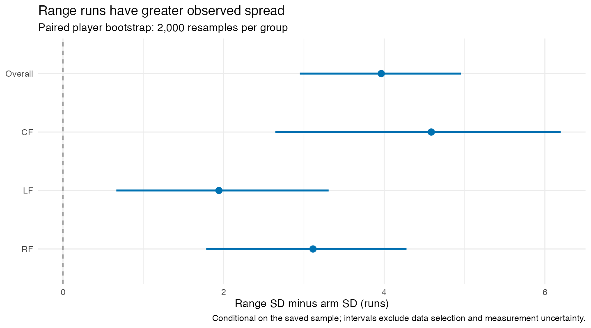
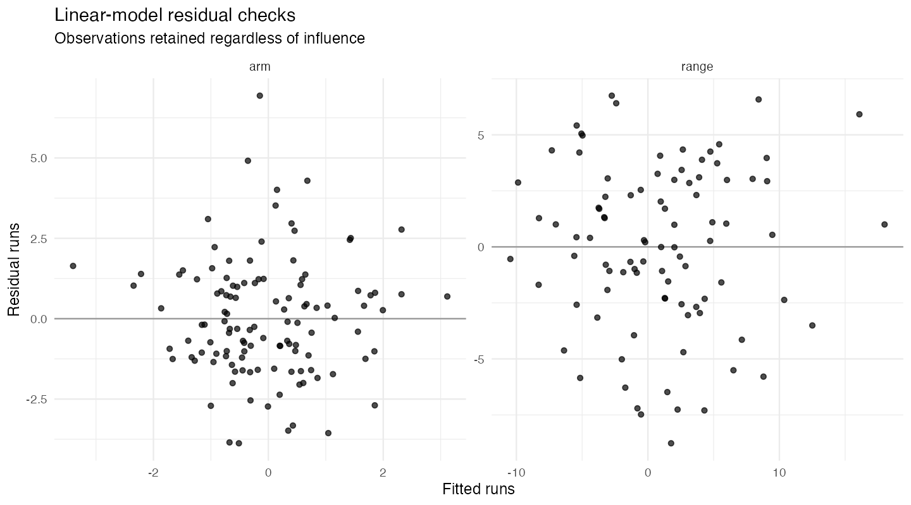
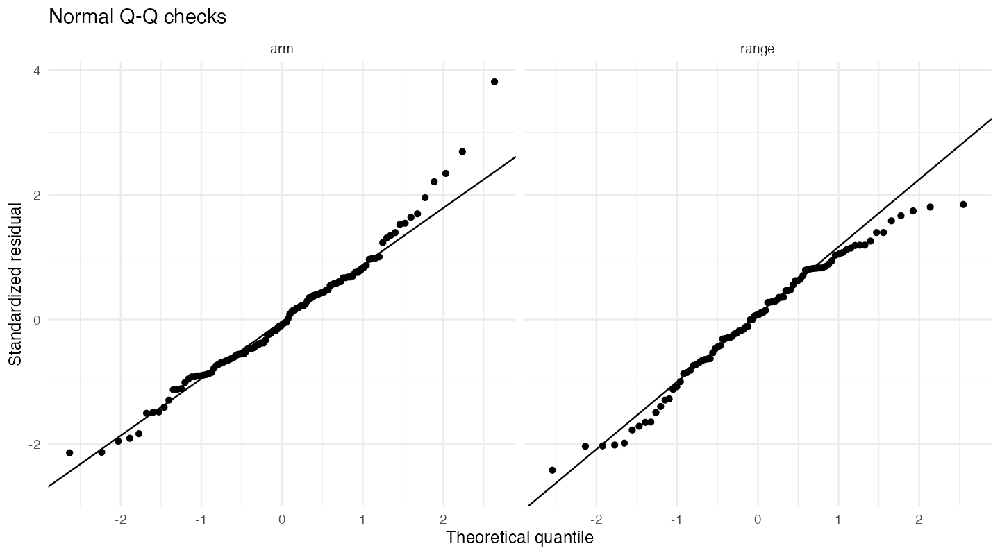
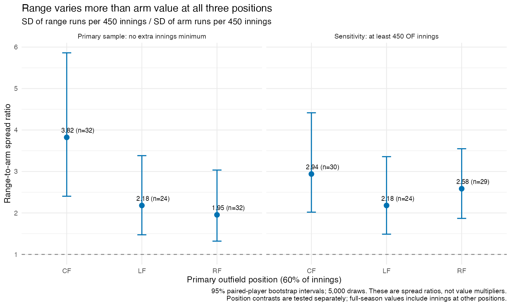

# Arm or Legs? Outfield Range and Throwing Value

Leo Foust | Saved 2025 analysis

# Main takeaways

In this saved 2025 sample, **range runs vary more between players than
throwing runs**, overall and within primary-position groups. Jump and
Burst carry more information about range value than sprint speed in the
fitted models. OF arm strength adds some information about throwing
value. Evidence that it materially improves prediction of runner
attempts is weak.

The question here is about what happened in this saved season. When I
say one component “matters more,” I am looking at how much it separates
the players in these measurements. That is different from proving how
much a training program would help or predicting next season. The
analysis also keeps track of how range and arm values vary together,
rather than turning them into percentages of each player’s total.

## Important audit correction

The original Arm Strength export lacked a year column and did **not**
match the official 2025 leaderboard. Early versions of the throwing
analyses used it. Those throwing results are superseded. The current
pipeline uses `arm_strength_2025_verified.csv`, extracted from records
explicitly tagged 2025. The original file remains unchanged for
provenance. This report and current CSV outputs are the authoritative
results; historical discussion summaries are not.

# Where the data came from

The data come from five Statcast exports and three FanGraphs files for
positional innings. The code joins players by ID because names can be
written differently. It converts baseball innings into outs before
adding them and leaves missing measurements as missing. If a player is
absent from a positional innings file, that is treated as zero innings
at that position, based on how the files were collected. Records with no
outfield innings stay in the data checks but are not used in the
analysis.

A player needs at least 60% of his outfield innings at one position to
receive that position label. Otherwise, he is in the multi-position
group. Each question uses the available players, but competing models
within that question always use the same group.

| Analysis availability      | Players |
|:---------------------------|--------:|
| arm_value_of_strength      |     118 |
| deterrence_of_strength     |     118 |
| range_speed_and_components |      92 |
| range_vs_arm               |     107 |
| range_vs_arm_by_position   |      88 |

Run `source("run_all.R")` from the RStudio project or
`Rscript --vanilla run_all.R` from its directory. The pipeline checks
SHA-256 hashes before and after, runs each script in a separate
environment, saves generated outputs and records R and package versions.
It installs nothing and needs no network access for reruns. Recorded
versions describe the successful environment; they are not a dependency
lockfile.

## Source verification

On 2026-10-01, the official 2025 qualified OAA roster matched all 110
saved players, with qualification flags and identical range runs. The
qualified Arm Value roster matched all 118 players and opportunity
counts. Arm run values had small revisions (maximum absolute difference
0.0713 runs); the analysis preserves the original snapshot. Sprint
Speed’s 579 players, displayed speeds and competitive-run counts matched
the official 2025 page. Arm Strength was replaced as described above.

Jump’s counts satisfy its published rule under the stated full-season
assumption. FanGraphs year provenance rests on the original collection
context and filenames; the files have no season column. Matching modern
snapshots cannot reconstruct all historical filters. The numerical Arm
Value qualification formula remains undocumented in the inspected public
interface; matching its qualified roster provides membership evidence
without inventing that formula.

# Range: speed or movement?

Every range model includes outfield innings and position. Innings help
account for playing time, although they do not tell us how difficult a
player’s chances were. To check a model, the code leaves one player out,
fits it on everyone else, and predicts that player. Then it repeats for
the others. RMSE gives more weight to large misses; MAE is the average
size of a miss. Both scores are in runs, and lower is better.

| model          | players | loocv_rmse | loocv_mae |
|:---------------|--------:|-----------:|----------:|
| baseline       |      92 |      5.901 |     4.710 |
| speed          |      92 |      5.656 |     4.685 |
| jump           |      92 |      3.951 |     3.149 |
| speed_and_jump |      92 |      3.950 |     3.227 |

| model                | players | loocv_rmse | loocv_mae |
|:---------------------|--------:|-----------:|----------:|
| baseline             |      92 |      5.901 |     4.710 |
| jump                 |      92 |      3.951 |     3.149 |
| reaction             |      92 |      5.555 |     4.416 |
| burst                |      92 |      3.687 |     2.959 |
| route                |      92 |      5.926 |     4.747 |
| all_components       |      92 |      3.789 |     3.049 |
| speed_and_components |      92 |      3.861 |     3.101 |
| without_reaction     |      92 |      3.750 |     3.015 |
| without_burst        |      92 |      5.200 |     4.123 |
| without_route        |      92 |      3.739 |     3.011 |

Jump helped explain range more than sprint speed alone did. Burst had
the best score among the individual movement components, but its small
advantage over Jump does not prove it is always better. Reaction and
Route had a correlation of about −0.85, so their separate effects are
hard to untangle when both are in the model. The models use either
overall Jump or its components, not both together.

These comparisons were explored after looking at the data. Testing
several models can make the best-looking result seem stronger than it
really is, even with cross-validation. The analysis does not include an
uncertainty interval for the difference between model errors or a test
on another season.

# Throwing value

These models use the corrected 2025 outfield arm-strength data. They
include advancement opportunities and position before adding strength.
The comparison using overall arm strength keeps the same players so that
changing the sample does not also change the comparison.

| model                        | players | loocv_rmse | loocv_mae |
|:-----------------------------|--------:|-----------:|----------:|
| baseline                     |     118 |      2.154 |     1.706 |
| of_strength                  |     118 |      1.912 |     1.494 |
| overall_strength_sensitivity |     118 |      1.912 |     1.494 |

Savant’s throwing-value calculation already uses throwing arm among its
inputs. That means the two measurements are connected by design. A model
coefficient shows a relationship after accounting for the other included
variables; it does not tell us how many runs a player would gain by
training to throw harder.

# Runner attempts

The runner-attempt models use the number of attempts and non-attempts.
This keeps track of how many opportunities each player’s rate is based
on. Both models include position, and the second adds outfield arm
strength. This type of model is called quasibinomial. It allows the
variation in the counts to differ from a standard binomial model. The
arm-strength effect is assumed to be the same across position groups.

| model | players | opportunities | player_rate_rmse | player_rate_mae | event_brier | event_log_loss | dispersion |
|:---|---:|---:|---:|---:|---:|---:|---:|
| position | 118 | 28455 | 3.04519 | 2.36823 | 0.22899 | 0.65049 | 0.87515 |
| position_and_arm | 118 | 28455 | 3.05966 | 2.37065 | 0.22898 | 0.65047 | 0.85545 |

Player-rate RMSE and MAE are percentage points; event scores are
unitless.

| contrast            | odds_ratio | lower_95 | upper_95 |
|:--------------------|-----------:|---------:|---------:|
| 5 mph harder OF arm |      0.971 |    0.942 |    1.002 |

The odds ratio describes the estimated change in odds for 5 more mph of
arm strength. It is not a percentage-point change in attempt rate, and
its interval depends on this model’s assumptions. Runner speed, ball
location, bases and outs, parks, and other play details are not
included. The score differences are too small to conclude that arm
strength meaningfully improved prediction. Giving each player equal
weight and giving each opportunity equal weight answer slightly
different questions.

# Range versus arm on the same players

| group | scale | players | range_sd | arm_sd | range_variance | arm_variance | twice_covariance | total_variance |
|:---|:---|---:|---:|---:|---:|---:|---:|---:|
| Overall | season_totals | 107 | 6.148 | 2.184 | 37.794 | 4.770 | 5.463 | 48.028 |
| CF | season_totals | 32 | 6.709 | 2.124 | 45.015 | 4.510 | 0.146 | 49.671 |
| LF | season_totals | 24 | 4.271 | 2.329 | 18.245 | 5.426 | 5.766 | 29.437 |
| RF | season_totals | 32 | 5.187 | 2.074 | 26.903 | 4.300 | 3.664 | 34.867 |

Total measured runs equal range runs plus arm runs. The spread of that
total also depends on whether the two components tend to move together.
In statistical terms: Var(T) = Var(R) + Var(A) + 2 Cov(R,A). That is why
the table includes covariance. A larger range spread does not mean every
player gets more value from range or that range is worth a fixed
multiple of throwing. Position groups use each player’s full-season
outfield values, including work at other positions.

To estimate uncertainty in the spread, the code repeatedly samples
players with replacement 2,000 times within each group. It keeps a
player’s range and arm values together. This is called a paired
bootstrap. The intervals describe uncertainty within this selected
sample. They do not account for every measurement problem, missing
player, qualification rule, or change from season to season.

# Checking whether the findings held up

| threshold | group   | players | range_sd | arm_sd | range_rate_sd | arm_rate_sd |
|----------:|:--------|--------:|---------:|-------:|--------------:|------------:|
|       0.5 | Overall |     107 |    6.148 |  2.184 |         7.350 |       2.595 |
|       0.5 | CF      |      37 |    7.056 |  2.049 |         8.583 |       2.161 |
|       0.5 | LF      |      27 |    4.311 |  2.342 |         4.922 |       2.292 |
|       0.5 | RF      |      34 |    5.129 |  2.202 |         5.810 |       3.120 |
|       0.6 | Overall |     107 |    6.148 |  2.184 |         7.350 |       2.595 |
|       0.6 | CF      |      32 |    6.709 |  2.124 |         8.468 |       2.215 |
|       0.6 | LF      |      24 |    4.271 |  2.329 |         4.729 |       2.169 |
|       0.6 | RF      |      32 |    5.187 |  2.074 |         5.889 |       3.013 |
|       0.7 | Overall |     107 |    6.148 |  2.184 |         7.350 |       2.595 |
|       0.7 | CF      |      28 |    6.599 |  2.230 |         8.293 |       2.324 |
|       0.7 | LF      |      22 |    4.469 |  2.367 |         4.936 |       2.156 |
|       0.7 | RF      |      27 |    5.409 |  2.072 |         6.032 |       3.097 |

| family   | model      | scenarios | min_rmse_improvement | max_rmse_improvement |
|:---------|:-----------|----------:|---------------------:|---------------------:|
| arm      | strength   |        11 |              0.20479 |              0.26076 |
| attempts | strength   |        12 |             -0.00018 |              0.00028 |
| range    | burst      |        15 |              1.97019 |              2.33068 |
| range    | components |        15 |              1.92708 |              2.24647 |
| range    | jump       |        15 |              1.49191 |              2.01517 |
| range    | speed      |        15 |              0.05444 |              0.33878 |

I checked whether the position rule changed the results by using 50%,
60%, and 70% cutoffs. Players stay in the overall models while their
labels may change. The position-specific comparisons require the chosen
share of innings.

The code also flags players who have a large effect on a fitted model,
using Cook’s distance greater than 4/n, where n is the sample size. It
then repeats the analysis without each flagged player and without all of
them together. Competing models still use the same players in each
check. These are ways to test the findings, not reasons to delete
players just because the results look better without them. The checks
change one choice at a time.

Range still had a larger spread after removing each of the 107 players
one at a time. Other checks compared runs per 1,000 innings and the
values left after accounting for innings with a linear model. Neither
approach fully accounts for different defensive opportunities. Some
unusually large model errors remained. The saved linear-model results
include HC3 standard errors, which allow for unequal error variation. No
player was automatically removed for being influential.

# What this means for baseball

## Completing the original position question

The original question also asked whether the balance changes between LF,
CF, and RF. The extension compares the spread of range and arm runs per
450 innings and directly estimates differences between positions. It
uses the existing 60% position rule without a new innings minimum as its
primary sample.

| scenario    | position | players | range_sd | arm_sd | sd_ratio |
|:------------|:---------|--------:|---------:|-------:|---------:|
| primary     | CF       |      32 |    3.811 |  0.997 |    3.823 |
| primary     | LF       |      24 |    2.128 |  0.976 |    2.180 |
| primary     | RF       |      32 |    2.650 |  1.356 |    1.954 |
| minimum_450 | CF       |      30 |    2.996 |  1.019 |    2.939 |
| minimum_450 | LF       |      24 |    2.128 |  0.976 |    2.180 |
| minimum_450 | RF       |      29 |    2.701 |  1.045 |    2.585 |

| contrast | balance_ratio | lower_95 | upper_95 | lower_family | upper_family |
|:---------|--------------:|---------:|---------:|-------------:|-------------:|
| CF / RF  |         1.956 |    1.025 |    3.491 |        0.898 |        3.959 |
| CF / LF  |         1.753 |    0.931 |    3.106 |        0.803 |        3.588 |
| RF / LF  |         0.896 |    0.498 |    1.606 |        0.438 |        1.893 |

The ratio is range standard deviation divided by arm standard deviation.
Values above 1 mean range varies more; they are not value multipliers.
In the primary sample, the ratio is 3.82 in CF, 2.18 in LF, and 1.95 in
RF. The CF/RF contrast is 1.96, with a 95% interval of 1.03–3.49. A
wider interval that accounts for the three planned comparisons is
0.90–3.96, which includes no difference.

With a 450-inning minimum, the CF/RF contrast shrinks to 1.14. This
makes the position hierarchy uncertain. It does not mean positions are
equivalent. Range has the larger point-estimate spread in every
scenario; the 900-inning LF sample is small enough that its interval
includes equal spreads.

The extension uses 5,000 paired-player bootstrap draws within each
position. The three contrast intervals use a 98.33% percentile interval
as an approximate Bonferroni adjustment. Uncertainty remains conditional
on the selected players; the data do not isolate the effect of changing
a player’s position.

## Position interactions and arm-strength curvature

An interaction allows a skill’s relationship with the outcome to differ
by position. These comparisons use the same LF/CF/RF players for every
model within each question: 77 for range and 98 for arm value and runner
attempts.

| family   | model           | players |  rmse | units             |
|:---------|:----------------|--------:|------:|:------------------|
| range    | position_only   |      77 | 5.993 | runs              |
| range    | no_position     |      77 | 4.055 | runs              |
| range    | common_slope    |      77 | 3.926 | runs              |
| range    | position_slopes |      77 | 3.950 | runs              |
| arm      | position_only   |      98 | 2.134 | runs              |
| arm      | no_position     |      98 | 1.897 | runs              |
| arm      | common_slope    |      98 | 1.893 | runs              |
| arm      | position_slopes |      98 | 1.924 | runs              |
| attempts | position_only   |      98 | 3.112 | percentage points |
| attempts | no_position     |      98 | 3.364 | percentage points |
| attempts | common_slope    |      98 | 3.133 | percentage points |
| attempts | position_slopes |      98 | 3.096 | percentage points |

| model     | players |  rmse |   mae |
|:----------|--------:|------:|------:|
| baseline  |     118 | 2.154 | 1.706 |
| linear    |     118 | 1.912 | 1.494 |
| quadratic |     118 | 1.907 | 1.469 |

Position improved the Jump model modestly, but separate position slopes
did not improve range or arm-value RMSE over shared slopes. Separate
slopes made a small improvement for runner attempts. The RF
strength–attempt slope was negative, but its interval adjusted for
checking three position slopes included zero. This is tentative evidence
rather than a strong deterrence result.

The quadratic arm model reduced RMSE from 1.912 to 1.907 runs. That is
too small an improvement to establish a useful velocity threshold. A
quadratic check does not test every possible nonlinear relationship.

## What this means for choosing a player

At equal exposure, a one-run range advantage offsets a one-run arm
disadvantage. It is the size of both differences that matters. Among CFs
with at least 450 innings, Victor Scott II’s range advantage over
Brenton Doyle was 3.97 runs per 450 innings and his arm disadvantage was
3.36, leaving him 0.61 ahead overall. Michael Harris II’s range
advantage over Doyle was only 0.19, against an arm disadvantage of 2.42,
leaving him 2.23 behind. These are observed 2025 rates, not predictions
of who would be the better future acquisition.

The hold, advance, and thrown-out components reconcile to arm runs for
all 118 players. The data can credit holds without a recorded out, but
do not establish that arm strength caused those holds. For example,
Michael Harris II had about +5.40 hold runs and −6.39 advance runs, with
zero recorded outs in the tracked advancement data, for about −0.99
total arm runs.

A question-by-question explanation is saved in
`reports/original_questions_answered.md`, and all extension outputs are
in `data/processed/original_questions/`. The extension was specified
after the initial findings and remains exploratory.

## Overall interpretation

The baseball takeaway is to look at how an outfielder moves toward the
ball, not just how fast he can run. Throwing needs its own outcome
because OAA measures range. This project does not establish that a right
fielder’s arm has a larger causal value than a left fielder’s, tell a
player how to train, or provide enough evidence for an acquisition
decision.

The project can be rerun from the saved 2025 data. A next step would be
to add another season and more detail about the plays each player faced.
That would help test whether the relationships hold up outside this
sample.

# Sources

- [Baseball Savant
  OAA](https://baseballsavant.mlb.com/leaderboard/outs_above_average)
- [Outfielder Jump](https://baseballsavant.mlb.com/jump)
- [Arm
  Strength](https://baseballsavant.mlb.com/leaderboard/arm-strength)
- [Arm
  Value](https://baseballsavant.mlb.com/leaderboard/baserunning?type=Fld)
- [Sprint
  Speed](https://baseballsavant.mlb.com/leaderboard/sprint_speed)
- [FanGraphs fielding
  leaderboards](https://www.fangraphs.com/leaders/major-league?stats=fld&season=2025&season1=2025)

Exact verification URLs and extracted public source records are saved in
`docs/verification`. Original source hashes are in
`docs/source_manifest.csv`.

# Validation

| check                                                | status |
|:-----------------------------------------------------|:-------|
| One master row per MLBAM ID                          | PASS   |
| Verified strength records have 2025 year             | PASS   |
| No zero-innings players in analysis samples          | PASS   |
| All OF strength candidates meet 50-throw rule        | PASS   |
| Direct comparison has both run values                | PASS   |
| Sample counts reconcile with full roster             | PASS   |
| OAA roster matches official qualified snapshot       | PASS   |
| OAA snapshot all qualified in 2025                   | PASS   |
| Arm Value roster matches official qualified snapshot | PASS   |
| Arm Value snapshot season is 2025                    | PASS   |
